# SKYBRIDGE

> Make stateful cloud migration a controlled, evidence-driven decision instead of a leap of faith.

**Stateful Multi-Cloud Workload Migration & Continuity Control Plane**

SKYBRIDGE helps platform, SRE, and cloud teams decide whether a stateful workload can safely move from one environment to another — then keeps its data continuously synchronized, validates the target, and performs a controlled ownership and traffic transition with every step recorded as evidence.

        

```text
FREE LOCAL v1
AWS → Azure migration workflow locally demonstrated
Real AWS/Azure execution intentionally deferred
Cloud spend: $0
```

### At a Glance

| | |
|---|---|
| **Problem** | Stateful multi-cloud workload migration |
| **Core challenge** | Move application + live database state without unsafe writes or stale migration assumptions |
| **Core mechanisms** | CDC + RPO + reconciliation + policy + approval + rehearsal + canary + quiesce + ownership + cutover |
| **AI** | Advisory only (`NEVER_BY_AI`) |
| **Validation** | Local end-to-end migration + 12-scenario failure matrix |
| **Cloud** | Real AWS/Azure intentionally deferred in v1 |
| **Cost** | $0 |

---

## 1. The Problem

Moving a **stateless** application is relatively straightforward: build it, deploy it somewhere else, point traffic at it.

Moving a **STATEFUL** production workload is fundamentally harder, because the application is not just compute. A migration involves the application runtime, the database state, ongoing writes, replication lag, infrastructure differences, configuration drift, approvals, traffic routing, ownership of writes, failure recovery, and rollback safety.

The naive approach — `deploy → copy database → switch traffic` — hides real risks:

- **Stale target state** — the copy is already old the moment traffic arrives.
- **Data loss** — writes accepted during the move land in the wrong place or nowhere.
- **Stale migration assumptions** — the plan described a world that changed since.
- **Incompatible infrastructure** — the target cannot actually run the workload.
- **Concurrent writers / split brain** — two environments both believe they own writes and diverge.
- **Unsafe rollback** — reversing after the new side owns writes destroys data.
- **Incomplete validation** — nobody checked the target behaves correctly first.
- **Stale approvals** — a human approved different evidence than what executes.
- **Failed or replayed operations** — retries double-apply or silently drop work.

Each of these is a data-loss or outage scenario. SKYBRIDGE exists so none of them happens by accident.

## 2. The SKYBRIDGE Answer

SKYBRIDGE treats migration as a **sequence of evidence-backed decisions** instead of one deployment command:

```text
Can it move?
    ↓
What needs to change?
    ↓
Does reality match the plan?
    ↓
Is migration authorized?
    ↓
Is the target synchronized?
    ↓
Does the target behave correctly?
    ↓
Can writes be safely quiesced?
    ↓
Can ownership move safely?
    ↓
Can traffic switch?
    ↓
Can we prove the result?
```

The Go control plane orchestrates these gates. Nothing advances without fresh evidence, policy approval where required, and a human decision where the risk demands one. Anything the system cannot establish fails **closed**: the migration pauses, it never proceeds on assumptions.

## 3. Why This Matters

| Challenge | Why it matters | SKYBRIDGE response |
|---|---|---|
| **Compatibility** | The target may not support the workload's requirements. | Rule-based engine verdicts `pass \| conditional \| unknown \| block`; only `pass` can proceed without gates. |
| **Drift** | The real environment stops matching the plan. | Desired vs. observed state compared; blocking drift denies cutover. |
| **Data replication** | State must flow continuously, not as a one-time copy. | PostgreSQL WAL → Debezium → Redpanda → CDC applier → target PostgreSQL, with idempotent event application backed by durable deduplication. |
| **RPO** | Cutover is only safe if lag is within tolerance. | Lag measured per run (source commit → apply); time-based gate against the workload's configured RPO. |
| **Reconciliation** | Replication success alone doesn't prove convergence. | Probe-scoped source/target comparison must match before readiness. |
| **Approval** | Risky steps need human accountability. | Policy-gated approvals: human-only, requester-distinct, bound to exact evidence, 24h expiry. |
| **Canary** | Full traffic on an unproven target is a blast radius. | Staged read-only evaluation (0/1/5/25/50/100) with exact thresholds; breaches block advancement. |
| **Write quiesce** | In-flight writes during handover create divergence. | Writes pause (503 + `Retry-After`); ownership stays put until CDC drains. |
| **Ownership** | Someone must be the single writer, unambiguously. | Exactly-once CAS transfer `aws → azure`, committed before exposure, source flips first. |
| **Split brain** | Two writers accepting authoritative writes diverge. | Per-request ownership enforcement in both shops; agreement verified after transfer. |
| **Idempotency** | Retries must not double-apply. | Same key + same body → replay; same key + different body → `409 IDEMPOTENCY_CONFLICT`. |
| **Recovery** | Failures mid-migration must resume, not strand. | Resume-forward paths for partial transfer, worker restart, and crash-between-commit-and-flips. |
| **Auditability** | Every decision must be reconstructable. | Request IDs, verified actors, approvals, policy hashes, evidence references, CDC positions on every transition. |
| **AI safety** | Probabilistic advice must never authorize action. | AI is advisory-only (`NEVER_BY_AI`); zero authority path into policy, approval, ownership, or execution. |

**Decision value, in one pattern — Evidence → Decision → Safety benefit:**

- CDC lag → *Is the target within RPO?* → Prevents premature cutover.
- Drift → *Does reality still match the plan?* → Prevents stale assumptions.
- Canary → *Does the target behave at partial traffic?* → Reduces blast radius.
- Ownership → *Who may accept writes?* → Prevents split brain.
- Approval → *Has a human accepted the risk?* → Adds accountability.
- AI review → *What does the evidence mean?* → Improves understanding without transferring authority.

## 4. Who Benefits

- **Platform Engineers** — *"Can I safely promote this target environment?"* Compatibility, plan, and drift evidence answer it.
- **SRE / DevOps Engineers** — *"Is CDC caught up enough to meet the migration's configured RPO?"* Measured lag and reconciliation say so, or the gate stays shut.
- **Cloud Architects** — *"What target-side capabilities and differences must be handled?"* The plan's per-component modes (`auto / gated / describe-only / blocked`) make it explicit.
- **Infrastructure Teams** — *"What exactly will the target contain?"* A deterministic, explainable desired-state document.
- **Technical Leads / Engineering Managers** — *"What evidence supports proceeding?"* The audit trail, evidence pack, and readiness checks.
- **Security / Compliance reviewers** — *"Who approved the operation and which policy and evidence were used?"* Verified actor identity, approval binding, and policy input hashes on every record.

SKYBRIDGE informs these decisions; it does not replace the people who make them.

## 5. Architecture

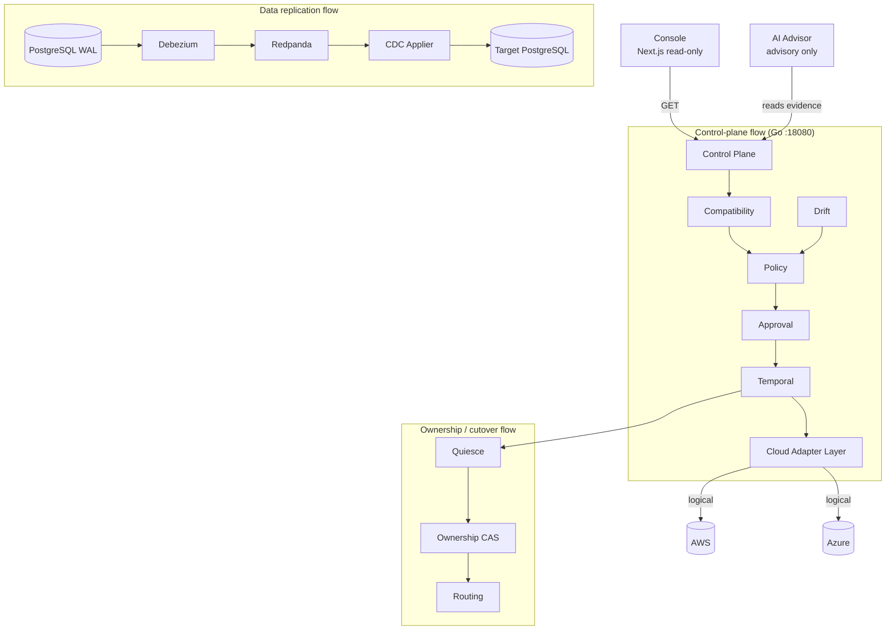

Three flows, kept separate by design: the **control plane** decides, **replication** moves data, and **cutover** moves authority. The console only observes (GET); the AI only advises (no authority path); adapters refuse real-cloud mutation (`ApplyEnabled=false`).

### Component responsibilities

| Component | Why it exists |
|---|---|
| **Console** | Operators need to *see* lifecycle, evidence, and safety state without any ability to mutate it. |
| **Control Plane** | One deterministic authority must sequence every gate instead of scattering checks across scripts. |
| **AI Advisor** | Humans need plain-language understanding of dense evidence — without giving the model any authority. |
| **Compatibility Engine** | "Can it move?" must be answered from registry evidence before anything is planned. |
| **Migration Planner** | A deterministic desired-state document prevents "works on my machine" target definitions. |
| **Drift Engine** | Plans rot; comparing desired vs. observed state keeps decisions anchored to reality. |
| **Policy Engine** | Rego contract + Go mirror give fail-closed, auditable allow/deny/approval-required decisions. |
| **Approval System** | Some risk can only be accepted by an accountable human, bound to exact evidence. |
| **Temporal** | Stage execution must be durable and resumable, separate from authorization. |
| **Cloud Adapters** | Provider specifics stay behind a seam that refuses real mutation in v1 (`LOCAL_FIXTURE`). |
| **Terraform** | Target infrastructure is declared as modules, validated (`fmt`/`validate`) but never applied. |
| **PostgreSQL** | The stateful core: source of truth, WAL event source, and durable control-plane store. |
| **Debezium** | Captures row-level change events from WAL without touching application code. |
| **Redpanda** | Durable, replayable event transport between capture and apply. |
| **CDC Applier** | Idempotent event application with durable deduplication (deterministic IDs + dedupe table + forward-only checkpoints). |
| **Reconciliation** | Replication "success" is a claim; probe-set comparison is the proof. |
| **Canary** | Partial-traffic behavior must be measured before commitment. |
| **Quiesce** | A final consistency window requires writes to pause while CDC drains to zero. |
| **Ownership** | Exactly one writer must exist at all times; the CAS record is that fact. |
| **Audit / Observability** | Without a complete trail, no migration decision is defensible after the fact. |

## 6. End-to-End: How SKYBRIDGE Works

1. **Register workload** — canonical spec validated against the JSON schema.
2. **Evaluate compatibility** — `pass / conditional / unknown / block` against the capability registry.
3. **Generate deterministic migration plan** — same inputs always yield the same target document.
4. **Detect drift** — observed target snapshot compared to desired plan.
5. **Evaluate policy** — stored evidence + runtime context → `allow / deny / approval_required`.
6. **Obtain human approval** when required — distinct human, evidence-bound, expiring.
7. **Rehearse migration** — full dry run against live replication, stopping at a proven READY boundary.
8. **Measure CDC/RPO and reconcile** — lag measured per run; probe sets must converge.
9. **Run canary stages** — 0 → 1 → 5 → 25 → 50 with exact volume/window/threshold gates.
10. **Quiesce source writes** — new writes pause; ownership stays with AWS.
11. **Catch up CDC** — catch up pending CDC changes and verify measured lag is within the configured RPO.
12. **Final validation** — preflight revalidates everything from fresh evidence.
13. **Transfer ownership AWS → Azure** — CAS commits first, source flips first, target second.
14. **Switch routing** — follows the committed ownership fact.
15. **Resume target writes** — Azure accepts; source stays quiesced and non-authoritative.
16. **Complete migration** — `CUTOVER_COMPLETE` with the full stage transcript.
17. **Verify source rejects writes** — AWS returns `WRITE_NOT_OWNED`.
18. **Verify reconciliation/audit evidence** — match + complete trail, or it didn't happen.

## 7. Cutover State Machine

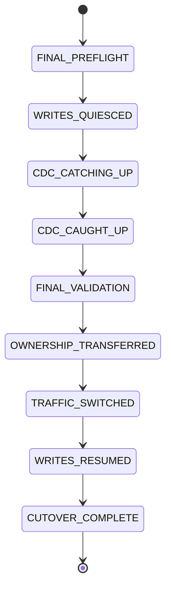

**Why this ordering matters:**

- **Why quiesce?** In-flight writes during handover would land on the wrong side. Pausing creates a bounded consistency window.
- **Why CDC catch-up?** Quiesce is only useful if replication then catches up pending CDC changes and measured lag verifies within the configured RPO — measured, not assumed.
- **Why final validation?** Evidence goes stale in seconds (lag jitter, new drift). Preflight re-evaluates everything immediately before the irreversible step.
- **Why ownership before routing?** Routing must follow authority, never precede it. Traffic sent to a non-owner would be rejected or, worse, accepted ambiguously.
- **Why source write rejection?** After transfer, AWS rejecting writes is the enforcement half of single-writer safety — verified live, not trusted.
- **Why is post-authority rollback blocked?** v1 has no reverse CDC: replaying old traffic onto AWS after Azure owns writes would fork history. Recovery is forward-fix from authoritative Azure state.

## 8. Key Engineering Features

### A. Compatibility Engine
Four verdicts, worst-wins aggregation (`block > unknown > conditional > pass`). `conditional` requires validation gates; `unknown` and `block` hard-deny automatic readiness. Fail-closed by construction: anything the engine cannot establish is never `pass`.

### B. Deterministic Migration Planning
The plan derives from (spec, compatibility report, registry) through pure functions with deterministic IDs — identical inputs always produce the identical document, so staleness is detectable by ID mismatch rather than guesswork.

### C. Drift Detection
Desired state (the plan) and observed state (snapshots) are separate records that are never merged. Findings carry severity (`informational / blocking / security_critical`); blocking drift denies cutover at the policy gate.

### D. PostgreSQL CDC
`PostgreSQL WAL → Debezium → Redpanda → CDC applier → target PostgreSQL`. Events carry deterministic IDs over source ordering identity; the applier dedupes via an `applied-events` table inside the same transaction and advances checkpoints forward-only.

### E. RPO / CDC Lag
Positions are measured per run: a pre-probe source position, the applied position, and `lag_seconds = observe − commit`. The gate compares measured lag against the workload's configured `rpo_seconds` — never a hardcoded constant, never an asserted value.

### F. Reconciliation
Replication moves bytes; reconciliation proves meaning. A deterministic probe set is written at the source and compared field-by-field at the target. `match=false` blocks readiness even when lag looks fine.

### G. Policy + Human Approval
Deterministic policy answers what the *evidence* permits; human approval answers who *accepts the risk*. Approvals bind the exact policy-input hash, expire in 24h, require a human distinct from the requester, and are revalidated for staleness at decision time and at use time.

### H. Canary
Stages 0/1/5/25/50 (plus a non-transferring 100 evaluation) with minimum volume, minimum windows, and exact error/latency thresholds. Low volume or short windows yield `INCONCLUSIVE`, never `PASS`. History is immutable; stale `expected_stage` values are rejected so lagging workers can't overwrite progress.

### I. Write Quiesce
A 503 + `Retry-After` backpressure signal — never silent drops. Reads continue; ownership is untouched; the caller retries. This is what makes the final drain window safe.

### J. Ownership / Split Brain
One CAS record, one transition (`aws → azure`), committed before the shop flips are exposed, source flipped first so any interruption leaves a both-reject paused state. Both shops enforce per-request ownership; reversal is refused; post-transfer state is verified from both sides.

### K. Idempotency
SHA-256 canonical-body fingerprints per `Idempotency-Key`: same key + same body replays the stored response; same key + different body is a `409` conflict that's also audited. Retries are safe by construction.

### L. Recovery
Partial transfers resume forward (source-already-safe detection), crashed attempts converge onto the committed fact, worker restarts re-drive flips idempotently, and CloudShop restarts restore durable admin state. Every path was built to be paused-safe: never dual-authoritative.

### M. Auditability
Every transition records request ID, verified actor, approval reference, policy bundle version, policy input hash, evidence IDs, CDC positions, and timestamps — the full chain from registration through `CUTOVER_COMPLETE` is reconstructable from the audit timeline alone.

### Live Migration Demo

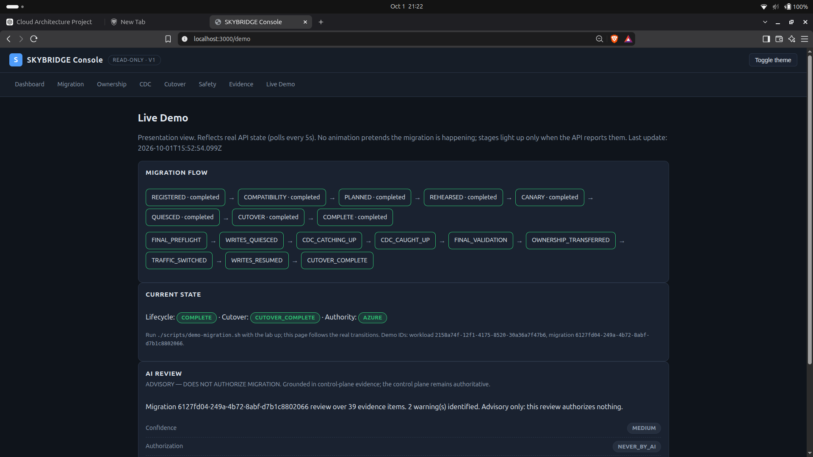

*Live local demonstration of the migration lifecycle through
CUTOVER_COMPLETE, with Azure becoming authoritative.*

## 9. AI-Assisted Migration Review

AI observes authoritative control-plane evidence — and nothing else.

**AI can:** summarize evidence · explain decisions · identify risks · suggest checks.
**AI cannot:** authorize · approve · execute · switch traffic · transfer ownership · invoke Terraform Apply.

```text
Control Plane Evidence
        ↓
Evidence filtering (subset + cited IDs only)
        ↓
AI review (mock-deterministic-v1 in the validated demo)
        ↓
Validated advisory result (schema + hostile-output checks)
        ↓
Human understanding
```

Every review carries `authorization: NEVER_BY_AI`, must cite supplied evidence IDs, and is rejected otherwise — including hostile outputs like `APPROVE`, `EXECUTE`, or `IGNORE POLICY`. The separation exists because probabilistic reasoning belongs in the advisory layer while deterministic authorization stays in the control plane. The validated local demo uses `mock-deterministic-v1`; no real external LLM was used in the validated acceptance flow.

### AI-Assisted Migration Review

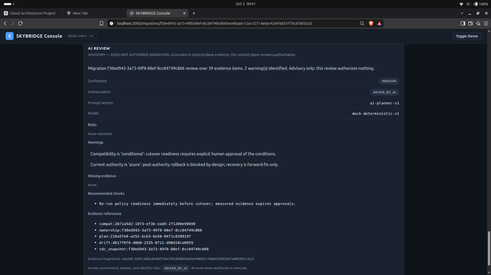

*Advisory analysis grounded in control-plane evidence; AI has
NEVER_BY_AI authorization and cannot execute migration actions.*

## 10. Security Model

Currently verified protections:

- Bearer authentication for local control-plane mutations (401 without valid credentials; header-claimed identity never trusted).
- Object-level authorization: owner-or-admin per workload, strict migration→workload binding (403/404).
- Policy gating (fail-closed), evidence freshness checks, approval binding with use-time revalidation.
- Idempotency conflict protection, ownership CAS, split-brain enforcement.
- Secret stripping in drift evidence, logs, and AI context; committed-credential scanning.
- AI isolation (zero authority path), read-only console (GET only), `ApplyEnabled=false`, real-cloud fail-closed adapters.

The local/dev authentication model is **NOT production identity infrastructure**. Production deployment would require stronger controls — OIDC/mTLS, secret management, TLS, rate limiting, hardened hosting — per `docs/SECURITY.md` (known limitations).

## 11. Observability + Audit

Operators can observe migration lifecycle, cutover stage, ownership, routing, CDC lag, source/applied positions, reconciliation, policy decisions, approvals, canary verdicts, quiesce state, rollback status, and the full audit timeline — plus a read-only status summary (`./scripts/skybridge-status.sh`). Every number shown is measured or read from authoritative state, which is what makes the go/no-go decision during cutover an evidence-backed decision rather than guesswork (human approval is still required wherever policy requires it).

## 12. The Console

A read-only Next.js console over the live control-plane APIs — an observability layer with intentionally **no mutation controls** in v1:

- **Dashboard** — providers, authority, routing, lifecycle at a glance.
- **Migration Detail** — stage-gated lifecycle for one migration run.
- **Ownership** — current owner, per-side writability, split-brain status.
- **CDC** — positions, lag vs. RPO, captured/applied/duplicates, reconciliation.
- **Cutover** — the 9-stage timeline with per-stage evidence.
- **Safety** — compatibility, drift gate, policy, approval, canary, quiesce, rollback.
- **Evidence** — PROVEN / PARTIALLY PROVEN / DEFERRED capability matrix.
- **Live Demo** — the demo flow reflecting real API-reported state.
- **AI Review** — advisory output rendered read-only, with evidence citations.

### Dashboard

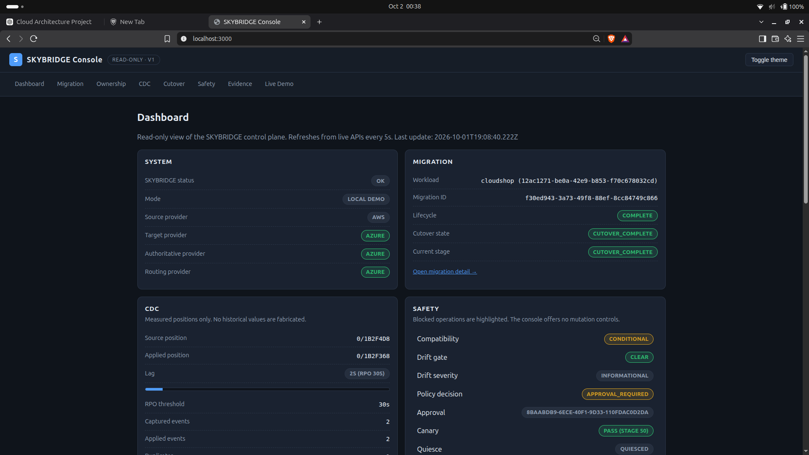

*Provider authority, routing, lifecycle, CDC, and safety state read from
live control-plane APIs.*

### Migration Detail

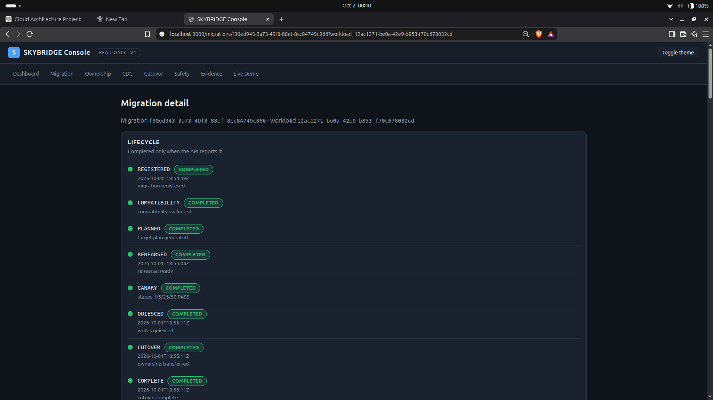

*Stage-gated migration lifecycle with the recorded progress and
cutover state.*

### CDC & RPO

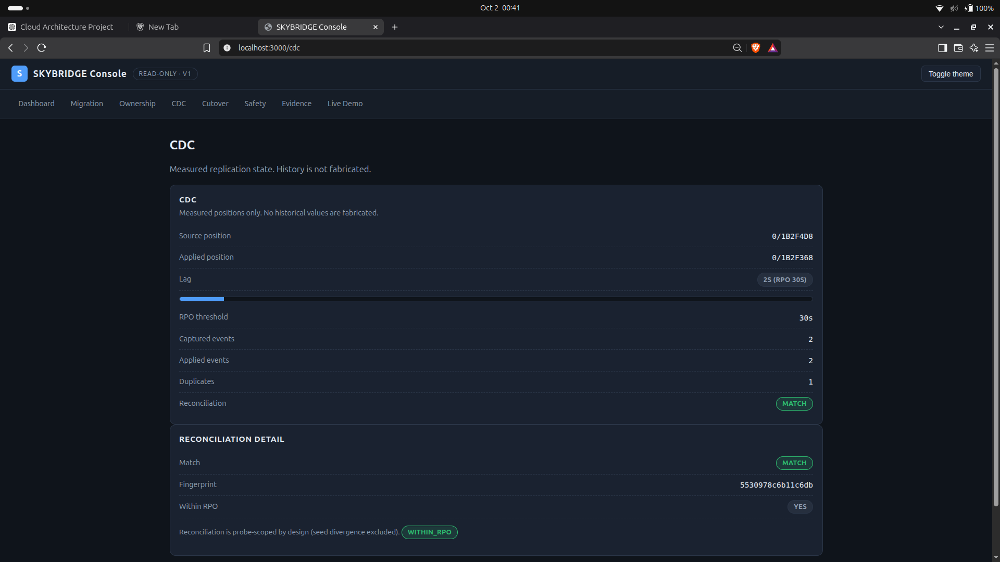

*Measured source/applied positions, CDC lag against the configured RPO,
and reconciliation state.*

### Ownership & Split-Brain Protection

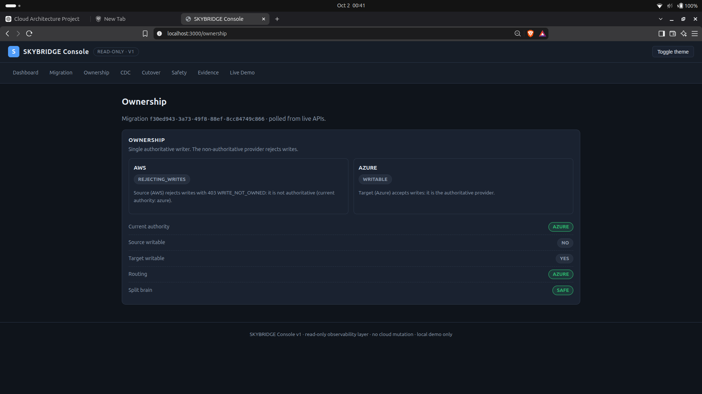

*Azure is authoritative and writable while AWS rejects writes,
demonstrating the single-writer ownership model.*

### Cutover Timeline

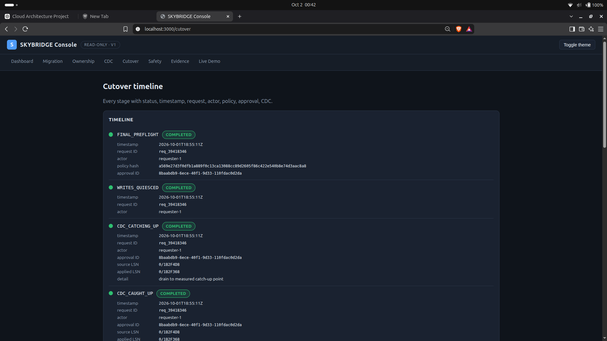

*The nine-stage cutover sequence with timestamps, actors, approval
references, policy evidence, and CDC positions.*

### Safety & Recovery Boundaries

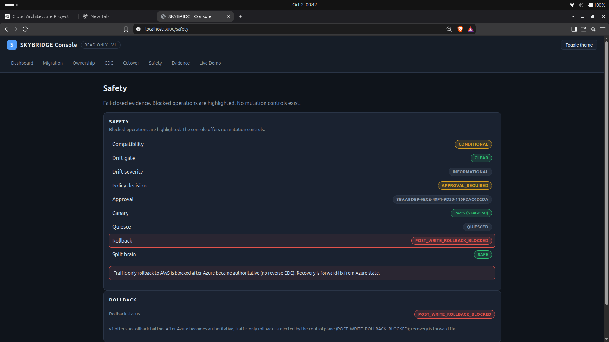

*Compatibility, drift, policy, approval, canary, quiesce, rollback, and
split-brain safety state in one view.*

### Evidence Matrix

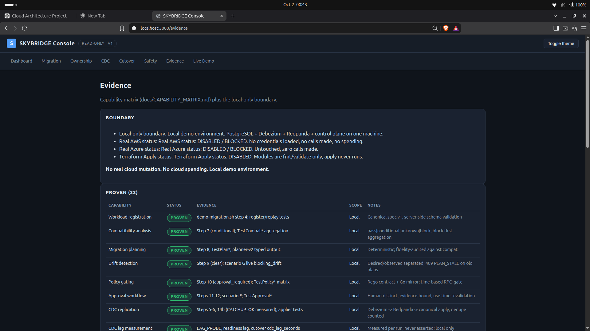

*Capabilities are explicitly separated into PROVEN, PARTIALLY PROVEN,
and DEFERRED with the local-only boundary shown.*

## 13. See SKYBRIDGE in Action

Local demonstration environment. Prerequisites: Docker, Go, Python 3, curl, Terraform (`fmt`/`validate` only), Node 22 for the console.

```bash
./scripts/doctor.sh                        # environment check → DOCTOR = PASS
docker compose up -d                       # lab: PG, Redis, Redpanda, Azurite, Temporal
docker compose --profile cdc up -d         # Debezium Connect (CDC runtime)
./scripts/portfolio-demo.sh                # full lifecycle → DEMO_MIGRATION = COMPLETE
```

Expected outcome: AWS → Azure with measured CDC lag, reconciliation match, Azure authoritative, Azure writes accepted, AWS writes rejected, split brain prevented — cloud spend $0. Then open the console (`apps/console`, `npm install && npm run dev`) at http://localhost:3000/demo.

Beyond the happy path:

```bash
./scripts/demo-failures.sh                 # 12 scenarios A–L → FAILURE_MATRIX = COMPLETE
```

The failure matrix exercises target outage, CDC stall, lag breach, reconciliation mismatch, canary breach, missing approval, blocking drift, stale evidence, concurrent cutover, worker restart, and partial transfer — proving the system fails closed instead of blindly continuing.

## 14. Proof / Evidence

Last full release audit (`SKYBRIDGE_TEST_ALL = PASS`, showcase reproduced twice). Statuses are exactly PROVEN / PARTIALLY PROVEN / DEFERRED — "local" means demonstrated on one machine; nothing below used real cloud.

| Capability | Status | Evidence | Scope |
|---|---|---|---|
| Workload registration | PROVEN | Register/replay tests | Local |
| Compatibility | PROVEN | Aggregation tests | Local |
| Planning | PROVEN | Deterministic planner tests | Local |
| Drift | PROVEN | Blocking-drift scenario | Local |
| Policy | PROVEN | Decision-matrix tests | Local |
| Approval | PROVEN | Binding/expiry/distinctness tests | Local |
| CDC | PROVEN | Debezium → Redpanda → apply + dedupe | Local |
| RPO measurement | PROVEN | Per-run measured lag vs. configured RPO | Local |
| Reconciliation | PROVEN | Probe-set match gating | Local |
| Rehearsal | PROVEN | `REHEARSAL_READY` dry runs | Local |
| Canary | PROVEN | Stages 0–50 + breach scenario | Local |
| Quiesce | PROVEN | 503 backpressure + drain | Local |
| Ownership | PROVEN | Exactly-once CAS + split-brain checks | Local |
| Cutover | PROVEN | `CUTOVER_COMPLETE`, 9 recorded stages | Local |
| Recovery | PARTIALLY PROVEN | Resume paths unit-proven | Local |
| Console | PROVEN | Read-only acceptance | Local |
| AI advisory | PROVEN | Mock-provider acceptance (`NEVER_BY_AI`) | Local |
| Temporal | PARTIALLY PROVEN | SDK workflows, mock activities | Local |
| Terraform | PARTIALLY PROVEN | 14 modules `fmt`/`validate` green | Local |

Full numbers and the deferred list: `docs/CAPABILITY_MATRIX.md`.

## 15. Real Cloud Boundary

```text
REAL CLOUD STATUS
AWS:               DISABLED / BLOCKED
Azure:             DISABLED / BLOCKED
Terraform Apply:   DISABLED (compile-time constant + adapter refusal + CI guard)
Cloud spend:       $0
Local environment: FULL WORKFLOW DEMONSTRATED
```

The architecture is designed for real-cloud integration, but v1 intentionally validates the migration workflow locally. Local-first validation allowed the migration control logic to be tested deterministically without incurring cloud cost or introducing production credentials. This limitation is stated openly, not hidden.

## 16. Test / Engineering Evidence

Last verified release audit (see `docs/CAPABILITY_MATRIX.md`):

- Control-plane unit tests: **201 passed, 0 failed** (+ race: 201 passed)
- CDC applier tests: **40 passed** · CloudShop tests: **15 passed**
- Contract pytest: **23 passed** · validator green · console tests: **34 passed** · AI tests: **41 passed**
- Acceptance magnets: **23 OK** · failure scenarios A–L: **12 scenarios, 10/10 rows PASS**
- Showcase: **7/7 PASS, reproduced twice** · Terraform: 14 modules validate green · spend $0, cloud calls 0

Targeted security remediation v1 (after that audit) added **22 tests** — 13 control-plane (`authz_test.go`: authentication, forged headers, wrong-actor, unauthorized workload/migration/approval/execute/cutover, mismatch, concurrency, crash recovery, audit forgery, valid-actor paths, demo path) and 9 CloudShop (`admin_auth_test.go`, `state_test.go`: admin 401/403, concurrency, restart recovery, persist failure, corruption) — with the control-plane suite + race and CloudShop suite + race green and `go vet` clean.

## 17. Failure Scenarios

Safe infrastructure fails closed rather than continuing blind. The matrix (live where deterministic, unit proofs otherwise): target database stopped · CDC consumer stopped · CDC lag above RPO · reconciliation mismatch · canary 5xx breach · missing approval · blocking drift · stale compatibility · stale plan · concurrent cutover (single transfer, identical bytes) · worker restart during cutover · partial ownership-transfer failure (paused-safe resume).

## 18. Technology Stack

| Layer | Technology | Why |
|---|---|---|
| Control plane | Go (stdlib + Temporal SDK) | Deterministic, single-binary orchestration with durable workflows |
| Advisory AI | Python | Evidence filtering, mock/deterministic review provider, schema validation |
| Console | Next.js / React | Read-only observability UI over live APIs |
| State & CDC source | PostgreSQL 17 | System of record + WAL event source |
| Change capture | Debezium | Row-level CDC without application changes |
| Event transport | Redpanda | Kafka-compatible, replayable local log |
| Execution | Temporal | Durable, resumable stage workflows |
| Cache | Redis (lab) + lazy-warm, non-authoritative cache semantics | Realistic workload shape; loss is a perf event, not data loss |
| Lab | Docker Compose, Azurite | One-machine cloud shape with $0 spend |
| IaC | Terraform (validate-only) | Declared targets, never applied in v1 |

## 19. Repository Structure

```text
apps/          control-plane (Go) · cdc-applier · agent-service (Python) · console (Next.js)
packages/      contracts: OpenAPI · Protobuf · JSON Schema · Rego policy
workloads/     cloudshop: the stateful demo workload (API + worker + migrations)
infrastructure/ terraform modules (14, validate-only) · helm/kind/argocd sketches
tests/         contract pytest + fixtures (drift snapshots, demo observations)
docs/          curated architecture, technical documentation,
               security, decisions, demo, and screenshots
scripts/       doctor · demo-migration · demo-failures · showcase · test-all · status
```

## 20. Engineering Highlights

- **Deterministic planning** — same evidence in, same plan out; staleness detected by ID, not timestamps.
- **Fail-closed compatibility** — anything unestablished denies; `unknown` never becomes `pass`.
- **Evidence freshness** — approvals bind policy-input hashes and are revalidated at decision *and* use time.
- **Human approval** — distinct, human-only, expiring, bound to exact evidence.
- **Event-level CDC deduplication** — deterministic IDs, transactional dedupe, forward-only checkpoints.
- **Measured RPO** — lag observed per run against the workload's configured threshold.
- **Ownership CAS + source-first transfer** — commit before exposure; interruptions land paused, never dual.
- **Split-brain prevention** — per-request enforcement plus post-transfer agreement checks.
- **Idempotency** — replay-vs-conflict semantics on every side-effecting route.
- **AI authority isolation** — `NEVER_BY_AI` with hostile-output rejection and evidence-citation enforcement.
- **Terraform Apply boundary** — four independent layers (constant, adapter, CI guard, tests) ensure apply can never run.

Simple deployment: `Build → Deploy → Switch`.
SKYBRIDGE: `Assess → Plan → Detect drift → Authorize → Rehearse → Replicate → Validate → Canary → Quiesce → Transfer ownership → Switch → Verify → Audit` — because migration evidence, state ownership, data synchronization, policy, approval, cutover safety, and AI assistance are one coordinated control-plane problem, not seven separate tools.

## 21. Future Work

Genuine deferred capabilities (not missing fixes): real AWS integration · real Azure integration · real traffic infrastructure · production RPO/RTO validation · reverse CDC · post-authority rollback · source teardown · production identity/security controls (OIDC/mTLS/secrets/TLS/rate-limiting) · production LLM path.

## 22. Quickstart

```bash
git clone <this-repo> && cd SKYBRIDGE
./scripts/doctor.sh                        # environment check → DOCTOR = PASS
docker compose up -d                       # lab: PG, Redis, Redpanda, Azurite, Temporal
docker compose --profile cdc up -d         # Debezium Connect (CDC runtime)
./scripts/demo-migration.sh                # ~5 min → DEMO_MIGRATION = COMPLETE
./scripts/demo-failures.sh                 # 12 scenarios → FAILURE_MATRIX = COMPLETE
./scripts/reset-demo.sh                    # → RESET_OK (AWS authoritative, clean)
./scripts/skybridge-status.sh              # read-only state summary
cd apps/console && npm install && npm run dev   # console → http://localhost:3000
```

Contributors: no performance, RPO/RTO, reliability, availability, cost, or success-rate claim without measured, reproducible evidence. Security model: `docs/SECURITY.md`.

---

*SKYBRIDGE v1 — local-first, evidence-driven migration control. Real clouds deferred, safety not.*
