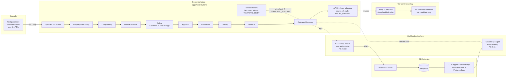
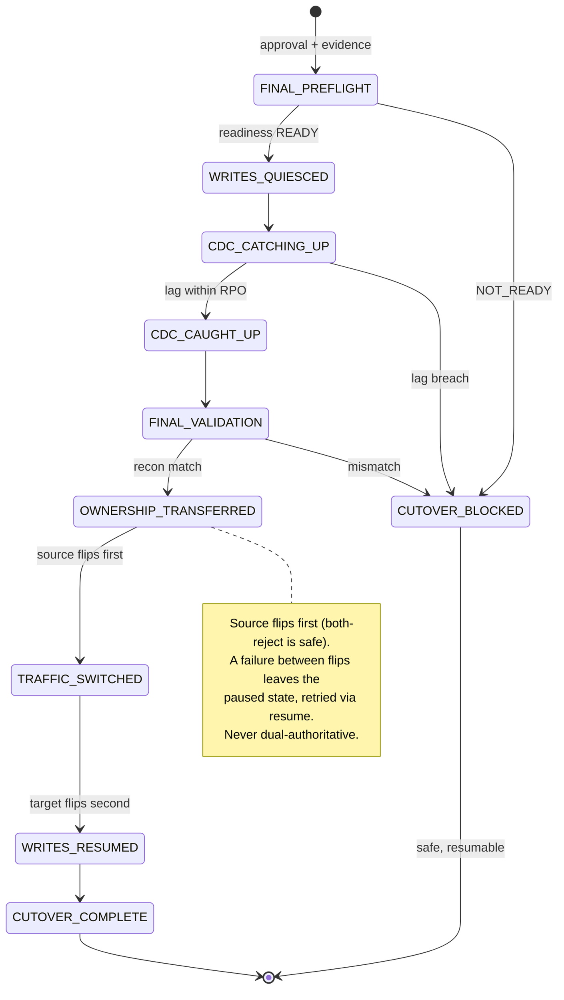

# Architecture (as implemented, local demo v1)

> Owner: SKYBRIDGE Engineering
> Status: accepted
> Version: 3
> Last updated: 2026-09-28
>
> This document describes what is actually implemented and demonstrated
> locally. Anything not listed here as implemented is deferred. Local
> demonstration is not proof of real-cloud behavior.

## 1. Big picture

## 2. Components

### Console (`apps/console`)

Read-only Next.js operator console over the live control-plane APIs
(dashboard, migration detail, ownership, CDC, cutover timeline, safety,
evidence, live-demo flow). It issues GET requests only — no Terraform
Apply/Destroy, no cloud mutations, no ownership transfer, no rollback
(`NO_MUTATION_CONTROLS` test + `scripts/acceptance-console.sh` enforce
this). A stage is shown completed only when the API reports it; when the
control plane is unreachable every value renders UNKNOWN. Verified by
`SKYBRIDGE_CONSOLE = PASS`.

### Control Plane (`apps/control-plane`)

One Go binary. HTTP API (`main.go`) over a `Store` interface with two
backends (`main.go:45-46`): `MemStore` default, `PGStore` when
`DATABASE_URL` is set. The local demo runs the control-plane
**in-memory** (fresh state per invocation); CloudShop uses PostgreSQL.
Long-lived history therefore lives in Redpanda topics and Postgres, not
in the demo control-plane process.

Routed resources: `/v1/workloads` (register, compatibility, plan, drift,
readiness, approvals), `/v1/migrations` (create, rehearse, canary,
quiesce, readiness, `cutover/final`), `/v1/migrations/...` execution
(`execute.go`), `/healthz`.

### Cloud Adapters (`adapter.go`, `adapter_aws.go`, `adapter_azure.go`, `adapter_translate.go`)

Provider-neutral `CloudAdapter` boundary: `ValidateTarget`,
`PlanInfrastructure`, `DescribeInfrastructure`, `VerifyInfrastructure`
are pure translations over deterministic local fixtures and always
report `source_of_truth: LOCAL_FIXTURE`. `ApplyInfrastructure`
unconditionally refuses (`apply_disabled`); the `ApplyEnabled=false`
constant (`tfvars.go:19`) is the hard switch. The live-read entry point
(`DescribeLiveEnvironment`) resolves sandbox identity and then refuses
without approved sandbox + budget — fail-closed, never falls back to
mock data, never touches real cloud APIs.

### Policy (`policy.go` + `packages/contracts/policy/cutover.rego`)

Decisions are exactly `allow | deny | approval_required`. The Rego file
is the contract; the Go evaluator is a rule-by-rule mirror (header
documents the mapping; deny reasons match `deny_reason` values
one-for-one). Gates: compatibility, drift (blocking +
security_critical; informational never blocks), target health, freshness
(`cdc_lag_seconds <= rpo_seconds`, **time-based**, not LSN), validation,
stage/ownership. Compatibility status is exactly one of
`pass | conditional | unknown | block`, aggregated
`block > unknown > conditional > pass`; only `overall == pass` may enter
automatic cutover readiness, and `conditional` always requires explicit
approval. If the engine cannot produce a valid decision the
mutation is denied and the workflow pauses — never fail open.

### Approval (`approval.go`)

Explicit, human-distinct-from-requester approvals bound to evidence via
`PolicyInputHash` (`approval.go:184`). Every use revalidates:
not-approved, expired, hash mismatch (`APPROVAL_STALE`), evidence
staleness, and policy-deny-at-use all refuse (`approval.go:363-390`).
Approval never executes anything; it only unlocks an already-gated
transition. Measured evidence (e.g. CDC lag seconds) is part of the
hash, so an approval goes stale when the world moves — the demo
re-approves rather than weakening the check.

### Temporal (`execute.go`, `temporal.go`, `workflow.go`, `temporal_test.go`)

Execution skeleton with deterministic workflow IDs, execution guard +
healing, and preconditions revalidated in-boundary. The client is set
only when `TEMPORAL_HOST` is configured; otherwise `/execute` fails
closed with `TEMPORAL_UNAVAILABLE` (`main.go:643-657`). The local demo
lifecycle runs through the direct control-plane endpoints, not through
Temporal workflows — Temporal orchestration of the full lifecycle is
deferred.

### PostgreSQL CDC, Debezium, Redpanda (`debezium/`, `docker-compose.yml`)

Source `cloudshop-db` (:5433, `wal_level=logical`) → Debezium connector
`cloudshop-pg-connector` (Kafka Connect :8083, `cdc` profile) →
Redpanda topics `cloudshop.public.users/orders/...` (:9092, Pandaproxy
:8082). Rehearsal/readiness replication consumes via Pandaproxy REST
(`rehearsal_cdc.go`: per-operation consumer group, `earliest` reset,
probe-ID filter, duplicate-safety replay proof).

### CDC Applier (`apps/cdc-applier`)

Canonical event mapping (`FromDebezium`, `event.go`) plus idempotent
target apply (`PostgresStore.ApplyAtomically`, `apply.go`):

- **Event identity** (`event.go:123-128`): `EventID` is deterministic
  over source ordering identity (table, PK, LSN/txn position) — never
  wall-clock, never arrival time.
- **Deduplication**: `cdc_applied_events(event_id)` is authoritative;
  replays are counted as duplicates, never double-applied
  (`checkpoint_ordering_test.go`, `TestDuplicateAfterRestartNoDoubleApply`).
- **Offset progression**: checkpoints advance only after a committed
  apply and never rewind past applied work (`checkpoint.go:115`);
  out-of-order arrivals fail explicitly for retry/inspection
  (`engine.go`).
- **Lag math** (`lag.go`): seconds between source commit and apply,
  RPO boundary at 30s.

`cmd/cdc-catchup` (demo step 14b) drains pending users/orders records
through this same path after quiesce: fresh consumer group per phase,
parents-before-children topic order (FK safety), tombstones skipped,
measured `CATCHUP_OK captured/applied/duplicates/skipped/max_lsn`.

### Reconciliation (`rehearsal_cdc.go:262-321`)

Compares the **probe set** between source and target; only probe IDs
gate `match`, table counts are context. Full-table comparison is
deliberately not gated: the two lab databases carry pre-existing seed
divergence (e.g. independently seeded `products` SKUs under different
IDs) unrelated to migration traffic.

### Canary (`canary.go`)

Canonical stages `0/1/5/25/50/100` (authority:
`docs/CUTOVER_ROUTING.md`). Stages 0–50 are read-only evaluations;
transfer happens only at final cutover. Per-stage minimum volume
(≥300 requests, ≥100 for stage 1) and observation windows (stage 50
requires ≥3600s). Thresholds compare target 5xx/p95/p99 against
baseline; `expected_stage` guards stale workers (409 on stale).

### Quiesce (CloudShop + control-plane `quiesce.go`)

Writes pause: order POSTs return `503 WRITES_PAUSED` while ownership
stays `aws`. Verified live in the demo (quiesced write → 503) and by
`quiesce_test.go`. Quiesce precedes final catch-up so no new source
writes arrive mid-drain.

### Ownership (CloudShop `ownership_test.go`, `cutover_final.go`)

Single-writer invariant enforced in both shops (`WRITE_NOT_OWNED` 403
on the non-authoritative side; `TestSplitBrainInvariant`). Transfer
uses a store CAS (`TransferOwnership aws -> azure`) that commits
exactly once (`cutover_final.go:19,271`), making concurrent cutovers
return byte-identical responses (failure-matrix scenario J).

### Cutover (`cutover_final.go`)

Nine recorded stages:

Preflight revalidates **everything** (never cached evidence). The
source admin flips first, the target second (`cutover_final.go:15-18,
220, 256`); any failure between flips leaves a paused, resumable state.

### Recovery

Worker-restart resume (exactly one transfer), partial-flip pause +
resume, quiesce/CDC/verify failure paths — proven by
`cutover_recovery_test.go` (failure-matrix scenarios K–L run these
unit proofs; live forcing would need timing hacks or faked metrics).

### Rollback restriction

v1 has **no reverse CDC**: after Azure becomes authoritative,
traffic-only rollback to AWS is rejected
(`cutover_final.go:11-12,170`). Recovery is resume-forward, not
roll-back. Source teardown is never automatic.

### AI advisory service (`apps/agent-service/skybridge_ai`)

Stateless Python service (stdlib HTTP, default port 18082) exposing
`POST /v1/ai/migration-review` and a read-only
`GET /v1/ai/migration-review?...` for the console. It fetches
authoritative evidence through control-plane GET endpoints only,
strips secrets, fingerprints the evidence bundle, asks the configured
model provider (deterministic mock by default; real LLMs never
required), and fail-safe-validates the structured review
(`authorization` always `NEVER_BY_AI`, every risk/warning cites a
supplied evidence id). The review never enters authorization:
policy, approval, ownership, cutover, Terraform, and cloud APIs are
unreachable from this path, and POST review leaves the audit trail
unchanged. Console shows it as an "ADVISORY — DOES NOT AUTHORIZE
MIGRATION" panel. Details: `docs/AI_MODEL.md`.

### Terraform boundary (`infrastructure/terraform`, `tfvars.go`)

14 versioned modules (aws-network/compute/database/object,
azure-network/compute/database/cache/object/queue/identity/routing/observability/security)
plus composed roots. Allowed locally: `fmt` + `validate` (via
`scripts/tf-plan.sh`, which never plans/applies). `terraform plan`
needs provider credentials (CI OIDC only); `apply`/`destroy` never run
from any script, and the adapter Apply path refuses regardless.

## 3. What is NOT implemented (deferred, not described as done)

Functional console UI is implemented (read-only, local); advisory AI
review is implemented (mock provider, local); Temporal-driven
full-lifecycle orchestration;
real AWS/Azure reads or writes; production RPO/RTO measurements;
reverse CDC; post-authority rollback; source teardown; managed-service
behavior (EKS/RDS/AKS/Azure-PG/Front Door/managed Redis are stood in
for by fixtures + local PostgreSQL — no Front Door or managed Redis
runs locally).
